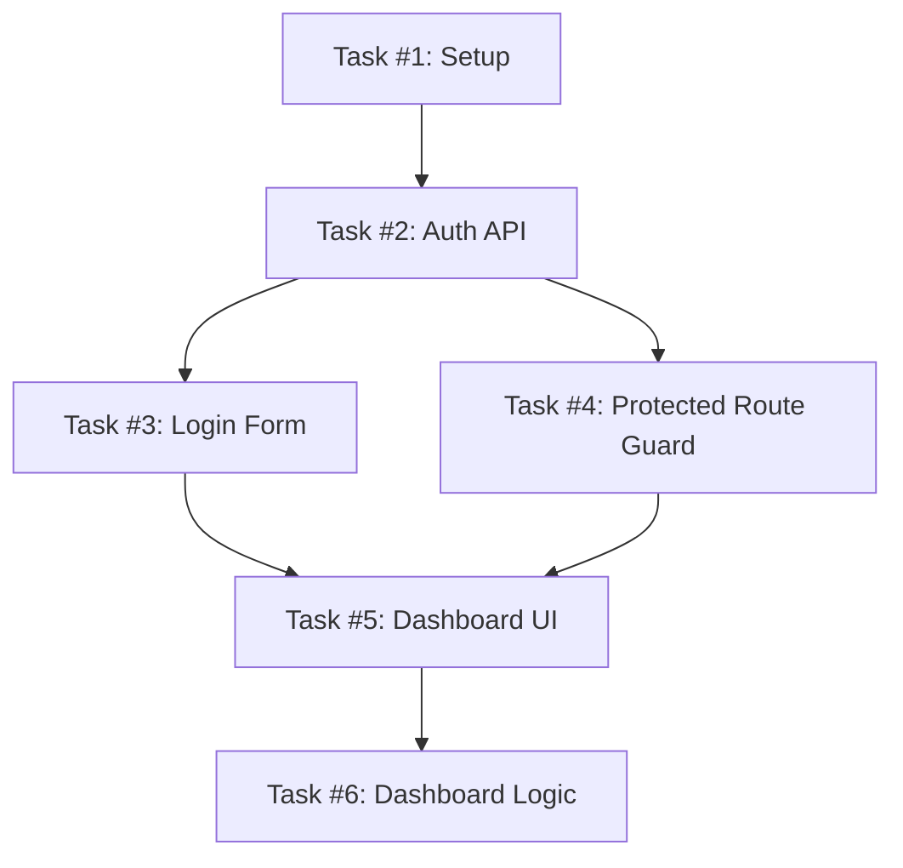

# Planning and Task Breakdown: From Spec to Actionable Units

## Overview

Decompose work into small, verifiable tasks with explicit acceptance criteria. Good task breakdown is the difference between an agent that completes work reliably and one that produces a tangled mess. Every task should be small enough to implement, test, and verify in a single focused session.

This skill integrates **timeline estimation**, **GitHub issue planning** integration, and **dependency mapping** for optimal sequencing.

---

## 🎯 Phase 1: When to Break Down Work

### ✅ Break Down When

- [ ] You have a spec but need implementable units
- [ ] A task feels too large or vague to start
- [ ] Work needs parallelization across agents/sessions
- [ ] You need to communicate scope to humans (for estimation/assignment)
- [ ] The implementation order isn't obvious

### ❌ Skip Breakdown, Go Directly to Implementation When

- [ ] Single-file changes with obvious scope (<50 lines)
- [ ] Configuration-only modifications
- [ ] Well-defined, self-contained fix where dependency mapping is trivial
- [ ] You already know the implementation steps and timeline is clear (<1 hour total)

---

## 📋 Phase 2: The Breakdown Process

### Step 1: Understand the Spec

**Read Thoroughly:**
- Identify user stories/requirements
- Note acceptance criteria for each
- Document edge cases mentioned
- List technical constraints or requirements

**Clarification Questions (If Missing):**
```
❓ Is X feature scoped to this iteration?
❓ Should Y error state show custom message or generic?
❓ Does Z need to work offline or only when online?
```

---

### Step 2: Map to Technical Components

**Identify:**
- Which files will be created/modified/deleted
- Dependencies between components
- Shared utilities needed across features
- Test coverage requirements per component

**Component Dependency Graph:**
```
┌──────────────┐       ┌──────────────┐       ┌──────────────┐
│  Component A │ ──→   │  Component B │ ──→   │  Component C │
│ (Login Form) │      │ (Auth Guard) │      │(Dashboard)    │
└──────────────┘       └──────────────┘       └──────────────┘
     ↑                        ↑                       ↑
 [1st]                   [2nd]                    [3rd]
```

---

### Step 3: Break Into Tasks (The Atomic Unit)

#### Task Sizing Rules

✅ **Good Task:**
- Can be completed in 1-4 hours max
- Touches 1-5 files max
- Has clear completion criteria
- Testable independently
- Doesn't depend on other tasks being merged first

❌ **Bad Task:**
- "Implement authentication" (too broad)
- Touches >10 files
- Multiple features combined
- "Fix everything that's broken"
- Requires other tasks to be complete before verification

---

## 📊 Phase 3: Task Structure Template

### Complete Task Template

```markdown
## [TASK] #<number> <Title>

### Description
[Brief description of what this task does]

### Why It Matters
[Business/technical rationale for why this is needed]

### Acceptance Criteria
- [ ] Criterion 1 (testable, specific)
- [ ] Criterion 2 (measurable, verifiable)
- [ ] Criterion 3 (edge case covered)

### Technical Notes
- Files to create/modify/delete: [...list]
- Dependencies on other tasks: #XX → #YY
- Edge cases to handle: [...]

### Estimated Effort
⏱️ Time: ~2 hours
📁 Files: 3
🔗 Dependencies: Wait for #45 before starting

### Test Plan
```bash
# What tests will validate this?
npm run test -- --testNamePattern="feature X"
# Expected output: All tests pass
```

### Definition of Done
- [ ] Code implemented and working
- [ ] Unit tests added and passing
- [ ] Integration tests covering edge cases
- [ ] No new warnings in linter
- [ ] Documentation updated (if applicable)
```

---

## 🕐 Phase 4: Timeline Estimation (From Builder Integration)

### Estimation Strategy

**Base Units:**
- Type the task complexity into categories:
  - 🟢 Tiny (<30 lines, 1 file): 30 min
  - 🟡 Small (30-100 lines, 2-4 files): 2 hours
  - 🟠 Medium (100-300 lines, 5-8 files): 4-8 hours
  - 🔴 Large (>300 lines, 10+ files): 8-16 hours or split into multiple tasks

**Adjustment Factors:**
```
Base Estimate ×
├── Complexity Factor (novel pattern vs familiar) ×1.5-2x
├── Testing Effort (more edge cases = +30%)
├── Dependencies (waiting on other work = +20%)
└── Risk Factor (unknowns, untested areas) ×1.25x
```

### Parallelization Calculation

**Serial vs Parallel:**
```
Scenario: 4 tasks totaling 20 hours of work

Serial (one at a time):    ████████████████████ 20h
Parallel (2 concurrent):   ████░░ 8h + ████░░ 8h = 8h total calendar time
                           (start T1 & T3, then add T2 & T4 as dependencies allow)

Realistically with context switching:    ~12-14h actual calendar time
```

---

## 🔗 Phase 5: Dependency Mapping

### Dependency Types

#### 1. **Hard Blocker** (Must complete before)
```markdown
Task #23: Implement Payment API
└─ [HARD BLOCKER] Task #24: Add payment form to checkout
   (Can't build form until API exists)
```

#### 2. **Soft Dependency** (Recommended sequence but not required)
```markdown
Task #30: Style guide setup
└─ [SOFT] Task #35: Feature A styling
   (Feature works without it, but look feels unfinished)
```

#### 3. **Can Parallelize** (Independent, can do concurrently)
```markdown
Task #40: User dashboard component
Task #41: Admin dashboard component
└─ [PARALLEL] Both work independently of each other
```

---

## 📝 Phase 6: Output Deliverables

### Task Breakdown Document Structure

```markdown
# IMPLEMENTATION PLAN: [Project/Feature Name]

## Spec Reference
- Original spec: LINK TO SPEC.md
- Version: v1.2.0
- Date: 2026-08-06

---

## 📋 Summary
Total: 15 tasks
Estimated effort: 48 hours
Parallelization: 3 tracks can run concurrently

---

## 🔗 Dependency Graph



---

## 📊 Task List

### Track 1: Foundation (Tasks 1-3)
| ID | Task | Est. Time | Dependencies | Status |
|----|------|-----------|--------------|--------|
| #1 | Initialize project with OpenSpec scaffold | 2h | None | ⏳ Ready |
| #2 | Implement authentication API endpoints | 6h | #1 | ⏳ Ready |
| #3 | Create login form component | 4h | #2 | ⏳ Ready |

### Track 2: Core Features (Tasks 4-8)
| ID | Task | Est. Time | Dependencies | Status |
|----|------|-----------|--------------|--------|
| #4 | Add protected route guard | 3h | #2 | ⏳ Ready |
| #5 | Build dashboard layout | 6h | #3, #4 | ⏳ Blocked |
| #6 | Implement dashboard data fetching | 4h | #6 | 🔄 In Progress |

---

## 🧪 Test Strategy per Task

| Task | Unit Tests | Integration Tests | E2E Required? |
|------|------------|-------------------|---------------|
| #1 | ✅ Yes | ✅ Scaffold included | ❌ No |
| #2 | ✅ Yes | ✅ API contract validation | ⏱️ Optional (if public API) |
| #3 | ✅ Form validation tests | ✅ Render tests | ✅ Critical path |

---

## ⚠️ Risk Assessment

| Risk | Probability | Impact | Mitigation |
|-------|------------|---------|------------|
| Auth tokens expire unexpectedly | Medium | High | Implement refresh token auto-renewal |
| Third-party service API limits hit | Low | Medium | Add caching layer early |
| Component complexity exceeds estimates | Medium | Medium | Break into smaller sub-components if needed |

---

## 📣 Communication Plan

### Pre-Implementation
- [x] Spec approved by stakeholders
- [x] Task breakdown reviewed with team
- [ ] Implementation kickoff (schedule TBD)

### During Implementation
- [ ] Daily status updates (if sprint <5 days)
- [ ] Blockers escalated immediately
- [ ] PRs created per task (one PR = one task)

### Post-Implementation
- [ ] All tasks completed and tested
- [ ] Documentation updated
- [ ] ADR created if architectural decisions made
```

---

## 🎮 Phase 7: GitHub Issue Integration

### Auto-Generate Issues from Breakdown

When connected to GitHub/GitLab, automatically create issues:

```bash
# For each task in the breakdown:
for task in TASKS; do
  gh issue create \
    --repo $REPO \
    --title "[Feature] Task #${task.id}: ${task.title}" \
    --body-file ${task.file}
done
```

### Issue Template Generated
```markdown
## [TASK #XX] <Title>

### 📋 Description
[Brief from breakdown doc]

### ✅ Acceptance Criteria
- [ ] Criterion 1
- [ ] Criterion 2

### 🔗 Dependencies
- Blocked on: #YY (GitHub issue link)
- Unblocks: #ZZ (GitHub issue link)

### 🎯 Estimation
~${task.estimated_hours} hours

### 📍 Location in Repo
Files to modify:
- `packages/frontend/src/components/...`
- `packages/backend/api/routes/...`

---

**Automatically generated from spec-driven breakdown on 2026-08-06.**
**Source specification:** [Link to original spec]
```

---

## 🧠 Phase 8: Common Breakdown Mistakes & How to Avoid Them

### Mistake #1: Combining Features in One Task
```markdown
❌ BAD TASK:
"#42 Implement User Authentication"
- Login form (frontend)
- Auth API endpoints (backend)
- Session management (shared)
- Password reset flow (entire feature)

✅ BETTER BREAKDOWN:
#42a: Design authentication flows (user stories)
#42b: Auth API - registration & login endpoints
#42c: Auth API - password reset & email verification
#42d: Shared auth utilities & types
#42e: Login form component with validation
#42f: Session management hook + provider
#42g: Protected route guard
```

### Mistake #2: Too Vague Acceptance Criteria
```markdown
❌ BAD:
"- [ ] Login works"
"- [ ] Tests pass"

✅ GOOD:
"- [ ] User can register with valid email and password (min 8 chars)"
"- [ ] Registration error shows inline validation message"
"- [ ] Email verification link expires after 24 hours"
"- [ ] Login accepts email OR registered username"
"- [ ] Session persists across tabs (localStorage sync)"
"- [ ] Protected routes redirect to login on access attempt"
"- [ ] Unit tests cover happy path + edge cases for validation"
```

---

## 🛠️ Phase 9: Tools & Integrations

### Command Line Workflow

```bash
# 1. Generate task breakdown from spec
npx open-spec breakdown --input specs/my-feature/spec.md --output tasks/

# 2. Review generated tasks (interactive mode)
cd tasks
open .       # Or review with your preferred tool

# 3. Export to GitHub/GitLab issues
npx task-exporter github --token $GITHUB_TOKEN --repo owner/repo

# 4. Create PRs per completed task
# After marking task done in tracker:
npx task-to-pr --task-id 42a --auto-branch
```

---

## ✅ Verification Checklist

Before finalizing breakdown:

### Structural Quality
- [ ] Each task can be completed independently (where parallelized)
- [ ] No task takes more than ~8 hours realistically
- [ ] All acceptance criteria are testable and measurable

### Completeness
- [ ] Edge cases considered for each task
- [ ] Dependencies mapped (hard blockers + soft dependencies)
- [ ] Test strategy defined per task

### Clarity
- [ ] Titles clearly describe what's being built
- [ ] Descriptions explain why it matters, not just what
- [ ] Acceptance criteria use Gherkin-like clarity (Given/When/Then)

### Practicality
- [ ] Can a human developer start this task and finish it without blocking on other tasks?
- [ ] Do the tools/integrations work for your team's workflow?
- [ ] Is there enough context in each task to avoid constant reference to parent doc?

---

## 📚 References

See `references/task-template.md` for reusable task templates.  
See `references/dependency-mapping-guide.md` for advanced dependency visualization techniques.  
See `docs/architecture/adr-002-task-decomposition-patterns.md` for how we decompose work in this project.

---

## Common Rationalizations & Reality Check

| Rationalization | Reality |
|-----------------|---------|
| "We can break tasks as we go, no need to plan" | Unplanned breaks lead to gaps, rework, and incomplete tasks that block others. Breakdown prevents scope creep mid-sprint. |
| "This is too detailed for a simple feature" | Every feature, no matter how simple, needs clarity on acceptance criteria. Simple features just have simpler breakdowns (maybe 2-3 tasks instead of 15). |
| "I'll write the PR description instead" | PR descriptions should validate work against pre-agreed acceptance criteria. Breakdown defines what you're building; PR confirms you finished it correctly. |
| "We use GitHub Projects, right? That's our plan" | GitHub Projects is where breakdown lives. Tasks in Projects are your implementation plan - vague epics without task-level breakdown lead to unpredictable sprints. |
