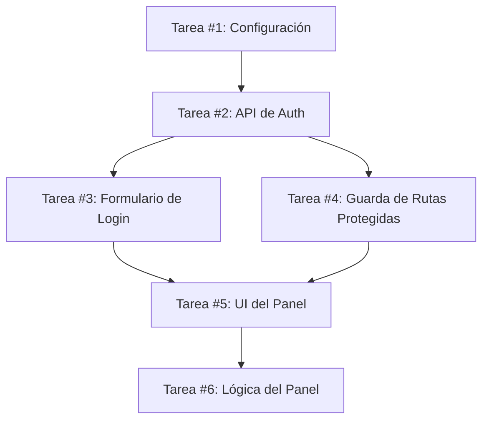

# Planificación y Desglose de Tareas: De la Especificación a Unidades Accionables

## Visión General

Descompón el trabajo en tareas pequeñas y verificables con criterios de aceptación explícitos. Un buen desglose de tareas es la diferencia entre un agente que completa el trabajo de forma fiable y uno que produce un lío enmarañado. Cada tarea debería ser lo suficientemente pequeña como para implementarla, probarla y verificarla en una única sesión enfocada.

Esta skill integra la **estimación de tiempos**, la integración con **planificación de issues en GitHub** y el **mapeo de dependencias** para un secuenciado óptimo.

---

## 🎯 Fase 1: Cuándo Desglosar el Trabajo

### ✅ Desglosa Cuando

- [ ] Tienes una especificación pero necesitas unidades implementables
- [ ] Una tarea se siente demasiado grande o vaga para empezar
- [ ] El trabajo necesita paralelización entre agentes/sesiones
- [ ] Necesitas comunicar el alcance a humanos (para estimación/asignación)
- [ ] El orden de implementación no es obvio

### ❌ Omite el Desglose, Ve Directo a la Implementación Cuando

- [ ] Cambios de un solo archivo con alcance obvio (menos de 50 líneas)
- [ ] Modificaciones solo de configuración
- [ ] Corrección bien definida y autocontenida donde el mapeo de dependencias es trivial
- [ ] Ya conoces los pasos de implementación y el tiempo es claro (menos de 1 hora en total)

---

## 📋 Fase 2: El Proceso de Desglose

### Paso 1: Entiende la Especificación

**Lee a fondo:**
- Identifica las historias de usuario/requisitos
- Anota los criterios de aceptación de cada una
- Documenta los casos límite mencionados
- Enumera las restricciones o requisitos técnicos

**Preguntas de Aclaración (si faltan):**
```
❓ ¿La función X está dentro del alcance de esta iteración?
❓ ¿El estado de error Y debe mostrar un mensaje personalizado o genérico?
❓ ¿Z necesita funcionar sin conexión o solo cuando está en línea?
```

---

### Paso 2: Mapea a Componentes Técnicos

**Identifica:**
- Qué archivos se crearán/modificarán/eliminarán
- Las dependencias entre componentes
- Las utilidades compartidas necesarias entre funciones
- Los requisitos de cobertura de tests por componente

**Grafo de Dependencias de Componentes:**
```
┌──────────────┐       ┌──────────────┐       ┌──────────────┐
│  Componente A│ ──→   │  Componente B│ ──→   │  Componente C│
│(Formulario de│      │ (Guarda Auth)│      │(Panel)       │
│   Login)     │      │              │      │              │
└──────────────┘       └──────────────┘       └──────────────┘
     ↑                        ↑                       ↑
 [1º]                    [2º]                    [3º]
```

---

### Paso 3: Divide en Tareas (La Unidad Atómica)

#### Reglas de Tamaño de Tareas

✅ **Buena Tarea:**
- Se puede completar en 1-4 horas como máximo
- Toca 1-5 archivos como máximo
- Tiene criterios de finalización claros
- Se puede probar de forma independiente
- No depende de que otras tareas se hayan fusionado primero

❌ **Mala Tarea:**
- "Implementar autenticación" (demasiado amplia)
- Toca más de 10 archivos
- Combina múltiples funciones
- "Arreglar todo lo que está roto"
- Requiere que otras tareas estén completas antes de la verificación

---

## 📊 Fase 3: Plantilla de Estructura de Tarea

### Plantilla Completa de Tarea

```markdown
## [TAREA] #<número> <Título>

### Descripción
[Breve descripción de lo que hace esta tarea]

### Por Qué Importa
[Justificación técnica/de negocio de por qué se necesita]

### Criterios de Aceptación
- [ ] Criterio 1 (comprobable, específico)
- [ ] Criterio 2 (medible, verificable)
- [ ] Criterio 3 (caso límite cubierto)

### Notas Técnicas
- Archivos a crear/modificar/eliminar: [...lista]
- Dependencias de otras tareas: #XX → #YY
- Casos límite a manejar: [...]

### Esfuerzo Estimado
⏱️ Tiempo: ~2 horas
📁 Archivos: 3
🔗 Dependencias: Espera a #45 antes de empezar

### Plan de Tests
```bash
# ¿Qué tests validarán esto?
npm run test -- --testNamePattern="feature X"
# Salida esperada: Todos los tests pasan
```

### Definición de Terminado
- [ ] Código implementado y funcionando
- [ ] Tests unitarios añadidos y pasando
- [ ] Tests de integración que cubren los casos límite
- [ ] Sin advertencias nuevas en el linter
- [ ] Documentación actualizada (si aplica)
```

---

## 🕐 Fase 4: Estimación de Tiempos (Integración con Builder)

### Estrategia de Estimación

**Unidades Base:**
- Clasifica la complejidad de la tarea en categorías:
  - 🟢 Diminuta (menos de 30 líneas, 1 archivo): 30 min
  - 🟡 Pequeña (30-100 líneas, 2-4 archivos): 2 horas
  - 🟠 Mediana (100-300 líneas, 5-8 archivos): 4-8 horas
  - 🔴 Grande (más de 300 líneas, 10+ archivos): 8-16 horas o dividir en múltiples tareas

**Factores de Ajuste:**
```
Estimación Base ×
├── Factor de Complejidad (patrón novedoso vs familiar) ×1.5-2x
├── Esfuerzo de Testing (más casos límite = +30%)
├── Dependencias (esperar otro trabajo = +20%)
└── Factor de Riesgo (incógnitas, áreas sin probar) ×1.25x
```

### Cálculo de Paralelización

**En Serie vs en Paralelo:**
```
Escenario: 4 tareas que suman 20 horas de trabajo

En serie (una a la vez):    ████████████████████ 20h
En paralelo (2 concurrentes): ████░░ 8h + ████░░ 8h = 8h de tiempo de calendario total
                           (empieza T1 y T3, luego añade T2 y T4 según lo permitan las dependencias)

En la práctica con cambio de contexto:    ~12-14h de tiempo de calendario real
```

---

## 🔗 Fase 5: Mapeo de Dependencias

### Tipos de Dependencias

#### 1. **Bloqueo Duro** (Debe completarse antes)
```markdown
Tarea #23: Implementar API de Pagos
└─ [BLOQUEO DURO] Tarea #24: Añadir formulario de pago al checkout
   (No se puede construir el formulario hasta que exista la API)
```

#### 2. **Dependencia Blanda** (Secuencia recomendada pero no obligatoria)
```markdown
Tarea #30: Configuración de la guía de estilos
└─ [BLANDA] Tarea #35: Estilizado de la función A
   (La función funciona sin ello, pero el aspecto se siente inacabado)
```

#### 3. **Se Puede Paralelizar** (Independiente, se puede hacer de forma concurrente)
```markdown
Tarea #40: Componente de panel de usuario
Tarea #41: Componente de panel de administrador
└─ [PARALELO] Ambas funcionan de forma independiente entre sí
```

---

## 📝 Fase 6: Entregables de Salida

### Estructura del Documento de Desglose de Tareas

```markdown
# PLAN DE IMPLEMENTACIÓN: [Nombre del Proyecto/Función]

## Referencia de la Especificación
- Especificación original: ENLACE A SPEC.md
- Versión: v1.2.0
- Fecha: 2026-08-06

---

## 📋 Resumen
Total: 15 tareas
Esfuerzo estimado: 48 horas
Paralelización: 3 pistas pueden ejecutarse de forma concurrente

---

## 🔗 Grafo de Dependencias



---

## 📊 Lista de Tareas

### Pista 1: Cimientos (Tareas 1-3)
| ID | Tarea | Tiempo Est. | Dependencias | Estado |
|----|-------|-------------|--------------|--------|
| #1 | Inicializar proyecto con el scaffold de OpenSpec | 2h | Ninguna | ⏳ Lista |
| #2 | Implementar endpoints de la API de autenticación | 6h | #1 | ⏳ Lista |
| #3 | Crear el componente del formulario de login | 4h | #2 | ⏳ Lista |

### Pista 2: Funciones Principales (Tareas 4-8)
| ID | Tarea | Tiempo Est. | Dependencias | Estado |
|----|-------|-------------|--------------|--------|
| #4 | Añadir guarda de rutas protegidas | 3h | #2 | ⏳ Lista |
| #5 | Construir el layout del panel | 6h | #3, #4 | ⏳ Bloqueada |
| #6 | Implementar la obtención de datos del panel | 4h | #6 | 🔄 En Progreso |

---

## 🧪 Estrategia de Tests por Tarea

| Tarea | Tests Unitarios | Tests de Integración | ¿E2E Requerido? |
|-------|-----------------|----------------------|-----------------|
| #1 | ✅ Sí | ✅ Scaffold incluido | ❌ No |
| #2 | ✅ Sí | ✅ Validación del contrato de la API | ⏱️ Opcional (si es API pública) |
| #3 | ✅ Tests de validación del formulario | ✅ Tests de renderizado | ✅ Ruta crítica |

---

## ⚠️ Evaluación de Riesgos

| Riesgo | Probabilidad | Impacto | Mitigación |
|--------|--------------|---------|------------|
| Los tokens de auth expiran inesperadamente | Media | Alto | Implementar renovación automática de refresh tokens |
| Se alcanzan los límites de la API de terceros | Baja | Medio | Añadir capa de caché desde el principio |
| La complejidad del componente supera las estimaciones | Media | Medio | Dividir en sub-componentes más pequeños si es necesario |

---

## 📣 Plan de Comunicación

### Pre-Implementación
- [x] Especificación aprobada por las partes interesadas
- [x] Desglose de tareas revisado con el equipo
- [ ] Kickoff de implementación (fecha por confirmar)

### Durante la Implementación
- [ ] Actualizaciones de estado diarias (si el sprint dura menos de 5 días)
- [ ] Los bloqueos se escalan inmediatamente
- [ ] PRs creados por tarea (un PR = una tarea)

### Post-Implementación
- [ ] Todas las tareas completadas y probadas
- [ ] Documentación actualizada
- [ ] ADR creado si se tomaron decisiones arquitectónicas
```

---

## 🎮 Fase 7: Integración con Issues de GitHub

### Generar Issues Automáticamente desde el Desglose

Cuando esté conectado a GitHub/GitLab, crea los issues automáticamente:

```bash
# Por cada tarea del desglose:
for task in TASKS; do
  gh issue create \
    --repo $REPO \
    --title "[Feature] Task #${task.id}: ${task.title}" \
    --body-file ${task.file}
done
```

### Plantilla de Issue Generada
```markdown
## [TAREA #XX] <Título>

### 📋 Descripción
[Resumen del documento de desglose]

### ✅ Criterios de Aceptación
- [ ] Criterio 1
- [ ] Criterio 2

### 🔗 Dependencias
- Bloqueada por: #YY (enlace al issue de GitHub)
- Desbloquea: #ZZ (enlace al issue de GitHub)

### 🎯 Estimación
~${task.estimated_hours} horas

### 📍 Ubicación en el Repo
Archivos a modificar:
- `packages/frontend/src/components/...`
- `packages/backend/api/routes/...`

---

**Generado automáticamente a partir del desglose dirigido por especificación el 2026-08-06.**
**Especificación fuente:** [Enlace a la especificación original]
```

---

## 🧠 Fase 8: Errores Comunes en el Desglose y Cómo Evitarlos

### Error #1: Combinar Funciones en una Sola Tarea
```markdown
❌ MALA TAREA:
"#42 Implementar Autenticación de Usuario"
- Formulario de login (frontend)
- Endpoints de la API de Auth (backend)
- Gestión de sesión (compartida)
- Flujo de restablecimiento de contraseña (función completa)

✅ MEJOR DESGLOSE:
#42a: Diseñar los flujos de autenticación (historias de usuario)
#42b: API de Auth - endpoints de registro y login
#42c: API de Auth - restablecimiento de contraseña y verificación de email
#42d: Utilidades y tipos de auth compartidos
#42e: Componente de formulario de login con validación
#42f: Hook de gestión de sesión + provider
#42g: Guarda de rutas protegidas
```

### Error #2: Criterios de Aceptación Demasiado Vagas
```markdown
❌ MALO:
"- [ ] El login funciona"
"- [ ] Los tests pasan"

✅ BUENO:
"- [ ] El usuario puede registrarse con email y contraseña válidos (mínimo 8 caracteres)"
"- [ ] El error de registro muestra un mensaje de validación en línea"
"- [ ] El enlace de verificación de email caduca después de 24 horas"
"- [ ] El login acepta email O nombre de usuario registrado"
"- [ ] La sesión persiste entre pestañas (sincronización con localStorage)"
"- [ ] Las rutas protegidas redirigen al login al intentar acceder"
"- [ ] Los tests unitarios cubren el camino feliz y los casos límite de validación"
```

---

## 🛠️ Fase 9: Herramientas e Integraciones

### Flujo de Trabajo en Línea de Comandos

```bash
# 1. Generar el desglose de tareas a partir de la especificación
npx open-spec breakdown --input specs/my-feature/spec.md --output tasks/

# 2. Revisar las tareas generadas (modo interactivo)
cd tasks
open .       # O revisa con tu herramienta preferida

# 3. Exportar a issues de GitHub/GitLab
npx task-exporter github --token $GITHUB_TOKEN --repo owner/repo

# 4. Crear PRs por tarea completada
# Después de marcar la tarea como hecha en el tracker:
npx task-to-pr --task-id 42a --auto-branch
```

---

## ✅ Lista de Verificación

Antes de finalizar el desglose:

### Calidad Estructural
- [ ] Cada tarea se puede completar de forma independiente (donde se paraleliza)
- [ ] Ninguna tarea toma más de ~8 horas en la práctica
- [ ] Todos los criterios de aceptación son comprobables y medibles

### Completitud
- [ ] Casos límite considerados para cada tarea
- [ ] Dependencias mapeadas (bloqueos duros + dependencias blandas)
- [ ] Estrategia de tests definida por tarea

### Claridad
- [ ] Los títulos describen claramente qué se está construyendo
- [ ] Las descripciones explican por qué importa, no solo qué se hace
- [ ] Los criterios de aceptación usan claridad tipo Gherkin (Dado/Cuando/Entonces)

### Practicidad
- [ ] ¿Puede un desarrollador humano empezar esta tarea y terminarla sin bloquearse en otras tareas?
- [ ] ¿Las herramientas/integraciones funcionan para el flujo de trabajo de tu equipo?
- [ ] ¿Hay suficiente contexto en cada tarea para evitar consultar constantemente el documento padre?

---

## 📚 Referencias

Consulta `references/task-template.md` para plantillas de tareas reutilizables.  
Consulta `references/dependency-mapping-guide.md` para técnicas avanzadas de visualización de dependencias.  
Consulta `docs/architecture/adr-002-task-decomposition-patterns.md` para saber cómo descomponemos el trabajo en este proyecto.

---

## Racionalizaciones Comunes y Comprobación de la Realidad

| Racionalización | Realidad |
|-----------------|----------|
| "Podemos desglosar las tareas sobre la marcha, no hace falta planificar" | Los desgloses no planificados generan huecos, retrabajo y tareas incompletas que bloquean a otros. El desglose previene el aumento de alcance a mitad del sprint. |
| "Esto es demasiado detallado para una función simple" | Toda función, por simple que sea, necesita claridad en los criterios de aceptación. Las funciones simples solo tienen desgloses más simples (quizás 2-3 tareas en lugar de 15). |
| "Escribiré la descripción del PR en su lugar" | Las descripciones de PR deberían validar el trabajo contra los criterios de aceptación previamente acordados. El desglose define lo que estás construyendo; el PR confirma que lo terminaste correctamente. |
| "Usamos GitHub Projects, ¿verdad? Ese es nuestro plan" | GitHub Projects es donde vive el desglose. Las tareas en Projects son tu plan de implementación: las epopeyas vagas sin desglose a nivel de tarea llevan a sprints impredecibles. |
