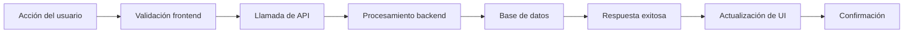
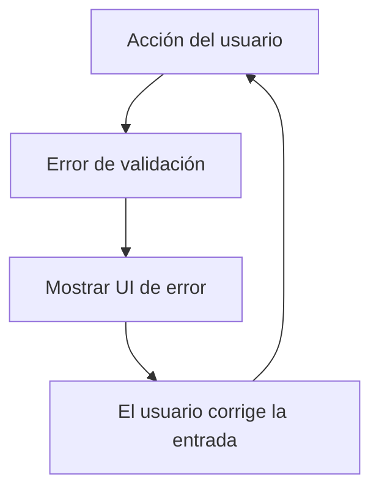

# Desarrollo guiado por especificación: construye desde la spec, no adivinando

## Descripción general

Escribe especificaciones estructuradas antes de escribir cualquier código. La spec es la fuente de verdad compartida entre tú y el ingeniero humano: define **qué** estamos construyendo, **por qué** y **cómo** sabremos que está terminado. El código sin spec es adivinar.

Esta skill integra la **generación de OpenSpec**, el **scaffolding automatizado de builds desde specs**, la **documentación de trazabilidad de requisitos** y la **preservación de artefactos** para referencia futura.

---

## 🎯 Fase 1: cuándo escribir una spec

### ✅ Escribe una spec cuando

- [ ] Los requisitos son ambiguos, incompletos o solo existen como ideas vagas
- [ ] El cambio toca múltiples archivos/módulos/equipos
- [ ] Estás a punto de tomar una decisión de arquitectura
- [ ] La tarea tomaría >30 minutos de implementación
- [ ] Existen múltiples enfoques de implementación
- [ ] Los stakeholders de negocio necesitarán criterios de aceptación claros
- [ ] El código necesita sobrevivir a cambios organizacionales

### ❌ Omite la spec, ve directo a la implementación cuando

- [ ] Arreglo de una línea o corrección de typo
- [ ] Cambio trivial (<10 líneas de código)
- [ ] Requisitos bien definidos y autocontenidos
- [ ] Cambio solo de configuración/contenido sin impacto de comportamiento
- [ ] Ya sabes exactamente qué construir y es <5 min de implementación

---

## 📋 Fase 2: estructura de la spec (formato OpenSpec)

### Plantilla completa de spec

```markdown
# SPECIFICATION: [Nombre de la funcionalidad/proyecto]

## 📌 Metadata
- **ID:** SPEC-[PROYECTO]-[NÚMERO]
- **Estado:** Borrador | Revisión | Aprobada | Reemplazada
- **Creada:** 2026-08-06
- **Última actualización:** 2026-08-06
- **Dueño:** @gonzoblasco
- **Stakeholders:** [Lista de personas/equipos afectados]

---

## 🎯 Metas y objetivos

### Meta principal
[Una frase: ¿qué problema estamos resolviendo?]

### Criterios de éxito
- [ ] La métrica A mejora un X%
- [ ] La funcionalidad B queda disponible para los usuarios
- [ ] El rendimiento se mantiene dentro del presupuesto Y

### Fuera de alcance
[Lista de lo que NO estamos construyendo]

---

## 🔍 Declaración del problema

[Explicación detallada del problema que se resuelve. Incluye:]
- Puntos de dolor o limitaciones actuales
- Investigación de usuarios o feedback que impulsa esto
- Datos/métricas que muestran por qué importa
- Soluciones alternativas consideradas y rechazadas

---

## 🏗️ Descripción general de la arquitectura

### Límites del sistema
```
┌─────────────────┐      ┌─────────────────┐      ┌─────────────────┐
│   Componente A  │  →   │   Componente B  │  →   │   Componente C  │
└─────────────────┘      └─────────────────┘      └─────────────────┘
     ↓                          ↓                          ↓
 [Entrada]                 [Procesamiento]            [Salida/Almacenamiento]
```

### Elecciones de tecnología
| Decisión | Opción elegida | Razonamiento | Alternativas consideradas |
|----------|---------------|-----------|-------------------------|
| Gestión de estado | React Query | Mejor práctica para estado del servidor, caché integrada | Zustand, Redux, SWR |
| Estrategia de auth | Basada en sesión | Simple, sin base de datos requerida para escalar | JWT, OAuth2, SAML |

---

## 📁 Modelo de datos

### Esquema de base de datos (si aplica)
```sql
CREATE TABLE users (
  id UUID PRIMARY KEY,
  email VARCHAR(255) UNIQUE NOT NULL,
  role VARCHAR(50),
  created_at TIMESTAMP DEFAULT NOW(),
  updated_at TIMESTAMP DEFAULT NOW()
);

-- Índices para rendimiento
CREATE INDEX idx_users_email ON users(email);
CREATE INDEX idx_users_role ON users(role);
```

### Definiciones de tipos (si es TypeScript)
```typescript
interface User {
  id: string;
  email: string;
  role: 'admin' | 'user' | 'guest';
  createdAt: Date;
  updatedAt: Date;
}
```

---

## 🎨 Mockups y wireframes de UI

[Incluye arte ASCII, diagramas mermaid o enlaces a mockups de Figma]

### Estado actual (Antes)
```
┌─────────────────────────────┐
│     Componente existente    │
│                             │
│   (Describe la UX actual)   │
│                             │
└─────────────────────────────┘
```

### Estado deseado (Después)
```
┌─────────────────────────────┐
│     NUEVA funcionalidad      │
│  ↑ Mejoras clave aquí ↓      │
│                             │
└─────────────────────────────┘
```

---

## 🔄 Flujos de usuario

### Camino feliz


### Camino de manejo de errores


---

## 🧪 Criterios de aceptación (Given-When-Then)

### Escenario 1: registro de usuario exitoso
**Dado** que el usuario ingresa un email válido  
**Cuando** hace clic en 'Registrarse'  
**Entonces** es redirigido al dashboard  
**Y** se envía un email de bienvenida  

### Escenario 2: formato de email inválido
**Dado** que el usuario ingresa un email inválido  
**Cuando** hace clic en 'Registrarse'  
**Entonces** aparece un mensaje de error explicando el problema  
**Y** permanece en la página de registro

---

## 🔒 Consideraciones de seguridad

- [ ] Validación y sanitización de entrada
- [ ] Verificaciones de autenticación/autorización
- [ ] Implementación de límite de peticiones
- [ ] Aplicación de HTTPS
- [ ] Requisitos de cifrado de datos sensibles
- [ ] Requisitos de cumplimiento (GDPR, CCPA, etc.)

---

## 📈 Requisitos de rendimiento

| Métrica | Objetivo | Herramienta de medición |
|--------|--------|------------------|
| Tiempo de carga inicial | < 1s | Lighthouse |
| Tiempo hasta interacción | < 3s | Web Vitals |
| Tiempo de respuesta del servidor | < 200ms | Métricas de API Gateway |
| Aumento de tamaño del bundle | < 10KB | Estadísticas de esbuild |

---

## 🧩 Desglose de componentes

### Árbol de componentes
```
FeatureName/
├── components/
│   ├── FeatureHeader/          # Componente de encabezado visual
│   │   ├── FeatureHeader.tsx
│   │   ├── FeatureHeader.test.tsx
│   │   └── stories/
│   │       └── FeatureHeader.stories.tsx
│   ├── FeatureForm/            # Formulario de entrada con validación
│   │   ├── FeatureForm.tsx
│   │   ├── FeatureForm.hooks.ts
│   │   └── types/
│   │       └── feature-form.types.ts
│   └── FeatureResults/         # Visualización de resultados
│       ├── FeatureResults.tsx
│       └── types/
│           └── result-types.ts
├── hooks/
│   └── useFeatureLogic.ts      # Hook de lógica de negocio
├── services/
│   └── feature-api.ts          # Capa de integración de API
└── tests/
    └── e2e/
        └── feature.spec.ts     # Test de punta a punta
```

---

## 🛠️ Plan de implementación

### Fase 1: Fundación (Semana 1)
- [ ] Configurar el scaffolding del proyecto con OpenSpec
- [ ] Definir tipos/interfaces compartidos
- [ ] Crear funciones/hooks de utilidad

### Fase 2: Funcionalidades principales (Semanas 2-3)
- [ ] Implementar la lógica de negocio principal
- [ ] Construir la capa de validación de formularios
- [ ] Configurar la integración de API

### Fase 3: Pulido y pruebas (Semana 4)
- [ ] Agregar pulido de UI y animaciones
- [ ] Escribir tests integrales
- [ ] Optimización de rendimiento
- [ ] Actualización de documentación

---

## 📝 Registro de decisiones

| Fecha | Decisión tomada | Alternativas consideradas | Impacto |
|-------|---------------|------------------------|---------|
| 2026-08-06 | Usar React Query para el estado del servidor | Zustand, SWR, Redux | Proporciona caché, estados de carga y manejo de errores listos para usar |

---

## 🔗 Matriz de trazabilidad

| ID de requisito | Sección de la spec | Archivo de test | Estado |
|----------------|-------------|-----------|--------|
| REQ-001 | Metas y objetivos | tests/registration.test.ts | ✅ Implementado |
| REQ-002 | Consideraciones de seguridad | tests/auth-security.test.ts | 🔄 En progreso |
| REQ-003 | Requisitos de rendimiento | perf/bundle-size.spec.ts | ⏳ Pendiente |

---

## 📚 Documentos relacionados

- [Registro de decisión de arquitectura #1](../docs/adr/adr-001-state-management.md): enfoque de gestión de estado
- [Guía de OpenSpec](https://openspec.dev/guide): referencia del formato de spec
- [Contrato de API](../../api/docs/openapi.json): especificación de API
- [Mockups de Figma](../design/mockups/): referencia de diseño visual

---

## 🚀 Estrategia de despliegue

### Plan de rollback
Si el despliegue falla:
1. Revierte a la versión anterior usando el tag/commit de Git
2. Notifica a los usuarios afectados vía página de estado
3. Depura y reintenta después de identificar la causa raíz

### Estrategia de feature flags
Envuelve la nueva funcionalidad detrás del flag `feature.new-feature.enabled` para un rollout gradual.

---

## 📣 Plan de comunicación

### Pre-implementación
- [ ] Reunión de revisión con stakeholders (Fecha: TBD)
- [ ] Sincronización del equipo para discutir el enfoque de implementación
- [ ] Creación del PR con la spec enlazada en la descripción

### Durante la implementación
- [ ] Actualizaciones de estado semanales
- [ ] Bloqueadores documentados y escalados
- [ ] Congelación del diseño después de la aprobación

### Post-implementación
- [ ] Anuncio del lanzamiento
- [ ] Documentación de lecciones aprendidas
- [ ] Traspaso al equipo de mantenimiento
```

---

## 🎮 Fase 3: scaffolding automatizado de builds desde specs

### Workflow de integración con OpenSpec

Usando **OpenSpec** para auto-generar la estructura del proyecto a partir de las especificaciones:

```bash
# Paso 1: escribe la spec en markdown
cat > specs/feature-name/spec.md <<EOF
[Pega aquí la especificación completa]
EOF

# Paso 2: genera el esqueleto del proyecto
npx open-spec generate --input specs/feature-name/spec.md --output projects/feature-name

# Paso 3: revisa la estructura generada
cd projects/feature-name
ls -laR

# Paso 4: personaliza e implementa
# (Edita los archivos generados, agrega la implementación real)
```

### Ejemplo de estructura generada
A partir de la spec de arriba, OpenSpec genera:
```
projects/feature-name/
├── specs/                  # Especificación original
│   └── spec.md            ← Tu spec de entrada
├── packages/               # Estructura de monorepo (si aplica)
│   ├── frontend/
│   │   ├── src/
│   │   │   ├── components/  ← Árbol de componentes desde la spec
│   │   │   ├── hooks/       ← Hooks definidos en la spec
│   │   │   ├── services/    ← Servicios de API
│   │   │   └── types/       ← Definiciones de tipos
│   │   ├── package.json
│   │   └── vite.config.ts
│   └── shared/              # Utilidades/tipos compartidos
│       ├── package.json
│       └── src/
├── docs/                   # Documentación desde la spec
├── scripts/                # Scripts de build/generación
└── README.md               # Auto-generado a partir de la metadata de la spec
```

---

## 🔄 Fase 4: trazabilidad de requisitos

### Mapear la especificación a la implementación

Crea un **documento de trazabilidad de requisitos** que mapee cada requisito a:

1. **Sección de la spec:** dónde está definido en la especificación
2. **Archivo de implementación:** qué archivo contiene el código
3. **Cobertura de tests:** qué tests lo validan
4. **Estado:** ✅ Implementado | 🔄 En progreso | ⏳ No iniciado

### Ejemplo de entrada de trazabilidad
```markdown
| ID | Descripción | Ubicación en la spec | Implementación | Tests | Estado |
|-----|-------------|---------------|----------------|-------|--------|
| AUTH-01 | El usuario debe autenticarse antes de acceder al dashboard | Consideraciones de seguridad, sección de flujo de auth | `packages/frontend/src/auth-guard.tsx` | `packages/frontend/tests/auth-guard.test.tsx` | ✅ Implementado
```

---

## 🧪 Fase 5: lista de verificación de calidad de la spec

Antes de aprobar una spec para implementación:

### Completitud
- [ ] Declaración clara del problema (no solo "necesitamos X")
- [ ] Criterios de éxito medibles
- [ ] Fuera de alcance definido explícitamente
- [ ] Casos límite considerados

### Claridad
- [ ] Los stakeholders no técnicos la entienden
- [ ] Sin jerga sin definición
- [ ] Los diagramas ilustran conceptos clave
- [ ] Los flujos de usuario están completos (camino feliz + caminos de error)

### Testabilidad
- [ ] Cada criterio de aceptación se mapea a un escenario testeable
- [ ] Las métricas de éxito son cuantificables
- [ ] La estrategia de rollback está definida si la funcionalidad falla

### Arquitectura
- [ ] Elecciones de tecnología justificadas con alternativas consideradas
- [ ] Consideraciones de escalabilidad y rendimiento abordadas
- [ ] Implicaciones de seguridad evaluadas
- [ ] Existe un plan de mantenimiento para actualizaciones futuras

### Alineación
- [ ] Consistente con los patrones de arquitectura existentes
- [ ] Encaja dentro de las capacidades de velocidad del equipo
- [ ] Restricciones de presupuesto/cronograma consideradas
- [ ] Dependencias identificadas y comunicadas

---

## 🚨 Racionalizaciones comunes y verificación de la realidad

| Racionalización | Realidad |
|-----------------|---------|
| "Resolveremos los detalles mientras codeamos" | Las ambigüedades se vuelven rework costoso; las specs previenen la deuda técnica antes de que empiece. |
| "Las specs nos frenan, mejor hagamos un MVP" | Las specs para MVPs siguen existiendo. Son más cortas, sí, pero aún necesitas claridad sobre qué construir. |
| "Usamos Agile, ¿verdad? Sin docs necesarios" | Los equipos Agile escriben user stories (que son specs). El mapeo de user stories es desarrollo guiado por especificación. |
| "Los mockups de Figma son nuestra spec" | El diseño visual ≠ requisitos. Los mockups muestran apariencia; las specs definen comportamiento, casos límite y criterios de éxito. |
| "Actualizaremos la documentación después" | La documentación que siempre es "después" se vuelve una instantánea incorrecta de la base de código en la que los nuevos miembros del equipo (y tú) confían erróneamente. |

---

## ✅ Puerta de verificación

### Antes de aprobar la spec para implementación:

- [ ] Todos los stakeholders la revisaron y aprobaron
- [ ] Los criterios de aceptación son testeables y medibles
- [ ] Decisiones de arquitectura documentadas (ADR creado si es necesario)
- [ ] Implicaciones de seguridad evaluadas
- [ ] Presupuesto de rendimiento establecido
- [ ] Capacidad del equipo confirmada
- [ ] Dependencias comunicadas a los equipos afectados

### Después de la implementación:

- [ ] El código coincide exactamente con la spec (¡sin scope creep!)
- [ ] Todos los criterios de aceptación pasaron
- [ ] Tests agregados para cada escenario
- [ ] Documentación actualizada (README, ADRs, docs en línea)
- [ ] Conocimiento compartido en la sincronización del equipo
- [ ] Spec marcada como 'Reemplazada' con enlace a la implementación

---

## 📚 Referencias

Consulta `references/spec-template.md` para plantillas y ejemplos de specs.  
Consulta `references/open-spec-guide/` para la referencia de comandos de OpenSpec.  
Consulta `docs/architecture/adr-001-state-management.md` para los patrones de arquitectura usados en este proyecto.
