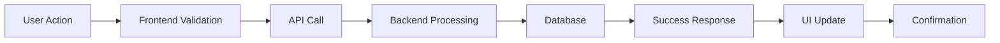
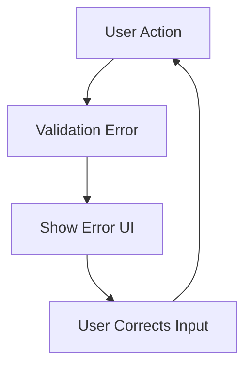

# Spec-Driven Development: Build from Specification, Not Guessing

## Overview

Write structured specifications before writing any code. The spec is the shared source of truth between you and the human engineer - it defines **what** we're building, **why**, and **how** we'll know it's done. Code without a spec is guessing.

This skill integrates **OpenSpec generation**, **automated build scaffolding from specs**, **requirements traceability documentation**, and **artifact preservation** for future reference.

---

## 🎯 Phase 1: When to Write a Spec

### ✅ Write a Spec When

- [ ] Requirements are ambiguous, incomplete, or only exist as vague ideas
- [ ] The change touches multiple files/modules/teams
- [ ] You're about to make an architectural decision
- [ ] The task would take >30 minutes to implement
- [ ] Multiple implementation approaches exist
- [ ] Business stakeholders will need clear acceptance criteria
- [ ] Code needs to survive organizational changes

### ❌ Skip Spec, Go Directly to Implementation When

- [ ] Single-line fix or typo correction
- [ ] Trivial change (<10 lines of code)
- [ ] Well-defined, self-contained requirements
- [ ] Configuration/content-only change with no behavioral impact
- [ ] You already know exactly what to build and it's <5 min implementation

---

## 📋 Phase 2: Spec Structure (OpenSpec Format)

### Complete Spec Template

```markdown
# SPECIFICATION: [Feature/Project Name]

## 📌 Metadata
- **ID:** SPEC-[PROJECT]-[NUMBER]
- **Status:** Draft | Review | Approved | Superseded
- **Created:** 2026-08-06
- **Last Updated:** 2026-08-06
- **Owner:** @user
- **Stakeholders:** [List people/teams affected]

---

## 🎯 Goals & Objectives

### Primary Goal
[One sentence: what problem are we solving?]

### Success Criteria
- [ ] Metric A improves by X%
- [ ] Feature B becomes available to users
- [ ] Performance stays within Y budget

### Out of Scope
[List what we're NOT building]

---

## 🔍 Problem Statement

[Detailed explanation of the problem being solved. Include:]
- Current pain points or limitations
- User research or feedback driving this
- Data/metrics showing why this matters
- Alternative solutions considered and rejected

---

## 🏗️ Architecture Overview

### System Boundaries
```
┌─────────────────┐      ┌─────────────────┐      ┌─────────────────┐
│   Component A   │  →   │  Component B   │  →   │  Component C   │
└─────────────────┘      └─────────────────┘      └─────────────────┘
     ↓                          ↓                          ↓
 [Input]                   [Processing]                [Output/Storage]
```

### Technology Choices
| Decision | Option Chosen | Reasoning | Alternatives Considered |
|----------|---------------|-----------|-------------------------|
| State Management | React Query | Server-state best practice, built-in caching | Zustand, Redux, SWR |
| Auth Strategy | Session-based | Simple, no DB required for scale | JWT, OAuth2, SAML |

---

## 📁 Data Model

### Database Schema (if applicable)
```sql
CREATE TABLE users (
  id UUID PRIMARY KEY,
  email VARCHAR(255) UNIQUE NOT NULL,
  role VARCHAR(50),
  created_at TIMESTAMP DEFAULT NOW(),
  updated_at TIMESTAMP DEFAULT NOW()
);

-- Indexes for performance
CREATE INDEX idx_users_email ON users(email);
CREATE INDEX idx_users_role ON users(role);
```

### Type Definitions (if TypeScript)
```typescript
interface User {
  id: string;
  email: string;
  role: 'admin' | 'user' | 'guest';
  createdAt: Date;
  updatedAt: Date;
}
```

---

## 🎨 UI Mockups & Wireframes

[Include ASCII art, mermaid diagrams, or link to Figma mockups]

### Current State (Before)
```
┌─────────────────────────────┐
│     Existing Component       │
│                             │
│   (Describe current UX)      │
│                             │
└─────────────────────────────┘
```

### Desired State (After)
```
┌─────────────────────────────┐
│     NEW Feature/Component    │
│  ↑ Key improvements here ↓   │
│                             │
└─────────────────────────────┘
```

---

## 🔄 User Flows

### Happy Path


### Error Handling Path


---

## 🧪 Acceptance Criteria (Given-When-Then)

### Scenario 1: Successful User Registration
**Given** the user enters a valid email  
**When** they click 'Sign Up'  
**Then** they are redirected to the dashboard  
**And** a welcome email is sent  

### Scenario 2: Invalid Email Format
**Given** the user enters an invalid email  
**When** they click 'Sign Up'  
**Then** an error message appears explaining the issue  
**And** they remain on the registration page

---

## 🔒 Security Considerations

- [ ] Input validation and sanitization
- [ ] Authentication/Authorization checks
- [ ] Rate limiting implementation
- [ ] HTTPS enforcement
- [ ] Sensitive data encryption requirements
- [ ] Compliance requirements (GDPR, CCPA, etc.)

---

## 📈 Performance Requirements

| Metric | Target | Measurement Tool |
|--------|--------|------------------|
| Initial Load Time | < 1s | Lighthouse |
| Time to Interactive | < 3s | Web Vitals |
| Server Response Time | < 200ms | API Gateway metrics |
| Bundle Size Increase | < 10KB | esbuild stats |

---

## 🧩 Component Breakdown

### Component Tree
```
FeatureName/
├── components/
│   ├── FeatureHeader/          # Visual header component
│   │   ├── FeatureHeader.tsx
│   │   ├── FeatureHeader.test.tsx
│   │   └── stories/
│   │       └── FeatureHeader.stories.tsx
│   ├── FeatureForm/            # Input form with validation
│   │   ├── FeatureForm.tsx
│   │   ├── FeatureForm.hooks.ts
│   │   └── types/
│   │       └── feature-form.types.ts
│   └── FeatureResults/         # Results display
│       ├── FeatureResults.tsx
│       └── types/
│           └── result-types.ts
├── hooks/
│   └── useFeatureLogic.ts      # Business logic hook
├── services/
│   └── feature-api.ts          # API integration layer
└── tests/
    └── e2e/
        └── feature.spec.ts     # End-to-end test
```

---

## 🛠️ Implementation Plan

### Phase 1: Foundation (Week 1)
- [ ] Set up project scaffolding with OpenSpec
- [ ] Define shared types/interfaces
- [ ] Create utility functions/hooks

### Phase 2: Core Features (Week 2-3)
- [ ] Implement main business logic
- [ ] Build form validation layer
- [ ] Set up API integration

### Phase 3: Polish & Test (Week 4)
- [ ] Add UI polish and animations
- [ ] Write comprehensive tests
- [ ] Performance optimization
- [ ] Documentation update

---

## 📝 Decision Log

| Date | Decision Made | Alternatives Considered | Impact |
|-------|---------------|------------------------|---------|
| 2026-08-06 | Use React Query for server state | Zustand, SWR, Redux | Provides caching, loading states, error handling out of the box |

---

## 🔗 Traceability Matrix

| Requirement ID | Spec Section | Test File | Status |
|----------------|-------------|-----------|--------|
| REQ-001 | Goals & Objectives | tests/registration.test.ts | ✅ Implemented |
| REQ-002 | Security Considerations | tests/auth-security.test.ts | 🔄 In Progress |
| REQ-003 | Performance Requirements | perf/bundle-size.spec.ts | ⏳ Pending |

---

## 📚 Related Documents

- [Architecture Decision Record #1](../docs/adr/adr-001-state-management.md) - State management approach
- [OpenSpec Guide](https://openspec.dev/guide) - Spec format reference
- [API Contract](../../api/docs/openapi.json) - API specification
- [Figma Mockups](../design/mockups/) - Visual design reference

---

## 🚀 Deployment Strategy

### Rollback Plan
If deployment fails:
1. Revert to previous version using Git tag/commit
2. Notify affected users via status page
3. Debug and retry after root cause identified

### Feature Flag Strategy
Wrap new feature behind flag `feature.new-feature.enabled` for gradual rollout.

---

## 📣 Communication Plan

### Pre-Implementation
- [ ] Stakeholder review meeting (Date: TBD)
- [ ] Team sync to discuss implementation approach
- [ ] PR creation with spec linked in description

### During Implementation
- [ ] Weekly status updates
- [ ] Blockers documented and escalated
- [ ] Design freeze after approval

### Post-Implementation
- [ ] Launch announcement
- [ ] Lessons learned documentation
- [ ] Handover to maintenance team
```

---

## 🎮 Phase 3: Automated Build Scaffolding from Specs

### OpenSpec Integration Workflow

Using **OpenSpec** to auto-generate project structure from specifications:

```bash
# Step 1: Write spec in markdown
cat > specs/feature-name/spec.md <<EOF
[Paste full specification here]
EOF

# Step 2: Generate project skeleton
npx open-spec generate --input specs/feature-name/spec.md --output projects/feature-name

# Step 3: Review generated structure
cd projects/feature-name
ls -laR

# Step 4: Customize and implement
# (Edit generated files, add actual implementation)
```

### Generated Structure Example
From the spec above, OpenSpec generates:
```
projects/feature-name/
├── specs/                  # Original specification
│   └── spec.md            ← Your input spec
├── packages/               # Monorepo structure (if applicable)
│   ├── frontend/
│   │   ├── src/
│   │   │   ├── components/  ← Component tree from spec
│   │   │   ├── hooks/       ← Hooks defined in spec
│   │   │   ├── services/    ← API services
│   │   │   └── types/       ← Type definitions
│   │   ├── package.json
│   │   └── vite.config.ts
│   └── shared/              # Shared utilities/types
│       ├── package.json
│       └── src/
├── docs/                   # Documentation from spec
├── scripts/                # Build/generation scripts
└── README.md               # Auto-generated from spec metadata
```

---

## 🔄 Phase 4: Requirements Traceability

### Mapping Specification to Implementation

Create a **requirements traceability document** that maps every requirement to:

1. **Spec Section:** Where it's defined in the specification
2. **Implementation File:** Which file contains the code
3. **Test Coverage:** Which tests validate it
4. **Status:** ✅ Implemented | 🔄 In Progress | ⏳ Not Started

### Example Traceability Entry
```markdown
| ID | Description | Spec Location | Implementation | Tests | Status |
|-----|-------------|---------------|----------------|-------|--------|
| AUTH-01 | User must authenticate before accessing dashboard | Security Considerations, Auth Flow section | `packages/frontend/src/auth-guard.tsx` | `packages/frontend/tests/auth-guard.test.tsx` | ✅ Implemented
```

---

## 🧪 Phase 5: Specification Quality Checklist

Before approving a spec for implementation:

### Completeness
- [ ] Clear problem statement (not just "we need X")
- [ ] Success criteria are measurable
- [ ] Out of scope is explicitly defined
- [ ] Edge cases are considered

### Clarity
- [ ] Non-technical stakeholders understand it
- [ ] No jargon without definition
- [ ] Diagrams illustrate key concepts
- [ ] User flows are complete (happy path + error paths)

### Testability
- [ ] Each acceptance criterion maps to a testable scenario
- [ ] Success metrics are quantifiable
- [ ] Rollback strategy is defined if feature fails

### Architecture
- [ ] Technology choices justified with alternatives considered
- [ ] Scalability and performance considerations addressed
- [ ] Security implications evaluated
- [ ] Maintenance plan exists for future updates

### Alignment
- [ ] Consistent with existing architecture patterns
- [ ] Fits within team velocity capabilities
- [ ] Budget/timeline constraints considered
- [ ] Dependencies identified and communicated

---

## 🚨 Common Rationalizations & Reality Check

| Rationalization | Reality |
|-----------------|---------|
| "We'll figure the details as we code" | Ambiguities become expensive rework; specs prevent technical debt before it starts. |
| "Specs slow us down, let's just MVP this" | Specs for MVPs still exist. They're shorter, yes, but you still need clarity on what to build. |
| "We use Agile, right? No docs needed" | Agile teams write user stories (which are specs). User story mapping is spec-driven development. |
| "The Figma mockups are our spec" | Visual design ≠ requirements. Mockups show appearance; specs define behavior, edge cases, success criteria. |
| "We'll update the docs later" | Documentation that's always 'later' becomes wrong codebase snapshot that new team members (and you) rely on incorrectly. |

---

## ✅ Verification Gate

### Before Approving Spec for Implementation:

- [ ] All stakeholders reviewed and approved
- [ ] Acceptance criteria are testable and measurable
- [ ] Architecture decisions documented (ADR created if needed)
- [ ] Security implications evaluated
- [ ] Performance budget set
- [ ] Team capacity confirmed
- [ ] Dependencies communicated to affected teams

### After Implementation:

- [ ] Code matches spec exactly (no scope creep!)
- [ ] All acceptance criteria passed
- [ ] Tests added for every scenario
- [ ] Documentation updated (README, ADRs, inline docs)
- [ ] Knowledge shared in team sync
- [ ] Spec marked as 'Superseded' with link to implementation

---

## 📚 References

See `references/spec-template.md` for spec templates and examples.  
See `references/open-spec-guide/` for OpenSpec command reference.  
See `docs/architecture/adr-001-state-management.md` for architectural patterns used in this project.
