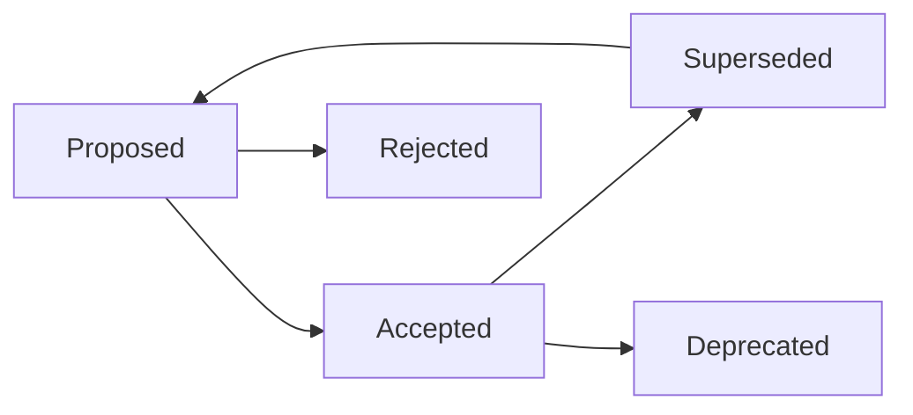

# ADR Patterns — Technical Documentation Reference

Patrones comunes de Architecture Decision Records.

## ADR Template

```markdown
# ADR-NNN: [Title]

**Status:** Proposed | Accepted | Deprecated | Superseded
**Date:** YYYY-MM-DD
**Context:** [What's the problem? What constraints exist?]

## Decision
[What did we decide?]

## Consequences
- **Positive:** [benefits]
- **Negative:** [trade-offs]
- **Risks:** [risks to monitor]

## Alternatives Considered
- **Alternative A:** [why not]
- **Alternative B:** [why not]
```

## Common ADR Patterns

### Hexagonal Architecture

```
Context: Need to decouple business logic from infrastructure
Decision: Use hexagonal architecture with ports and adapters
Consequences:
  + Business logic is testable without infrastructure
  + Easy to swap implementations
  - More boilerplate for interfaces
```

### Database Choice

```
Context: Need persistent storage for multi-tenant app
Decision: Use Supabase (PostgreSQL + RLS)
Consequences:
  + Built-in auth and RLS
  + Real-time subscriptions
  - Vendor lock-in consideration
```

### State Management

```
Context: Need client-side state management
Decision: Use React Query for server state, Context for UI state
Consequences:
  + No Redux boilerplate
  + Built-in caching and refetching
  - Learning curve for React Query patterns
```

## ADR Lifecycle



## Related

- [SKILL.md](../SKILL.md) — Workflow principal
- [Architecture Diagrams](./architecture-diagrams.md) — Diagramas C4
- [CHANGELOG Guide](./changelog-guide.md) — Guía de CHANGELOG
