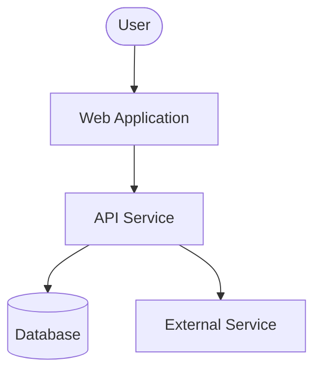
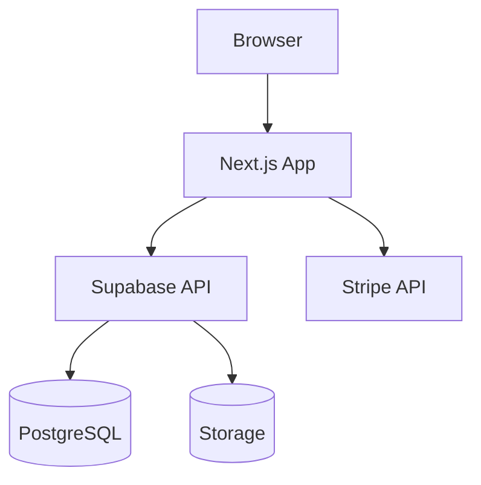
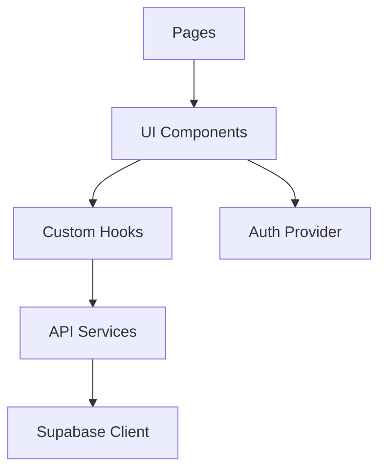
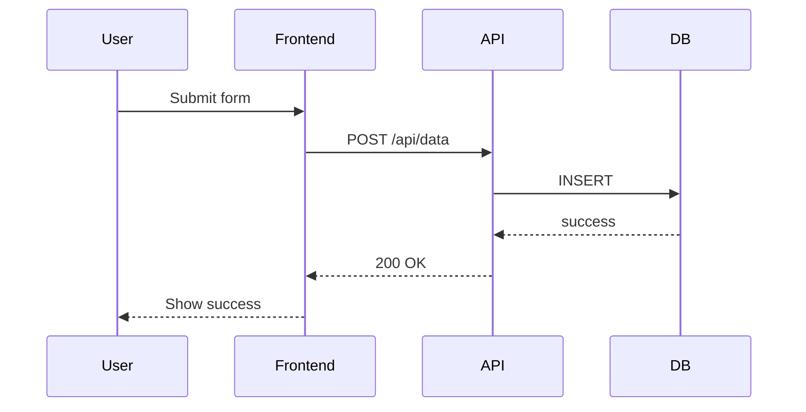
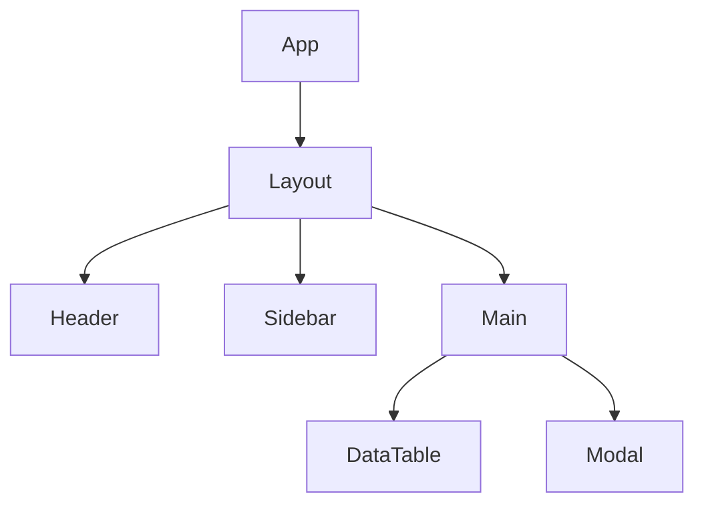

# Architecture Diagrams — Technical Documentation Reference

Guía para crear diagramas de arquitectura con Mermaid.

## C4 Model

### Context Diagram (Level 1)

### Container Diagram (Level 2)

### Component Diagram (Level 3)

## Common Diagrams

### Data Flow

### Component Tree

## Related

- [SKILL.md](../SKILL.md) — Workflow principal
- [ADR Patterns](./adr-patterns.md) — Patrones de ADRs
- [CHANGELOG Guide](./changelog-guide.md) — Guía de CHANGELOG
